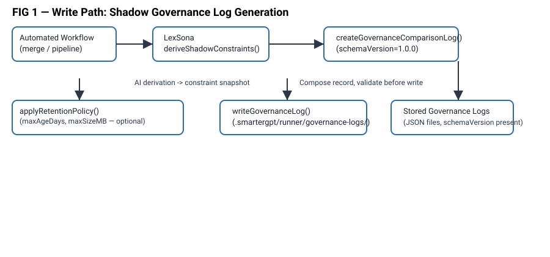
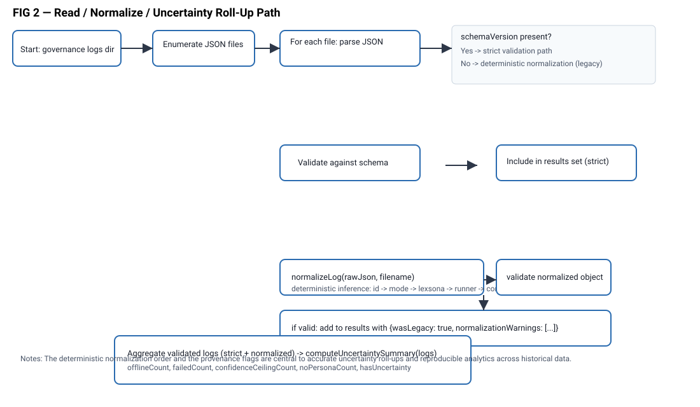

Title: Fail-Forward Shadow Governance Telemetry and Analysis

Inventor(s): Joseph M. Gustavson
Applicant: Joseph M. Gustavson
Filing date: 2025-12-07 (provisional draft)

Field of the Invention
This disclosure relates to method and system designs for logging, normalizing and analyzing "shadow governance" decisions produced by an AI governance engine operating alongside an automated workflow engine. The invention provides fail-forward legacy normalization of historical logs, explicit uncertainty surfacing for analysis, schema-aware log gating, CLI-driven reporting, and a robust backwards-compatible wrapper that preserves stdout purity and preserves exit codes.

Related Art
Modern automated workflow systems and CI/CD tools often generate audit and governance logs that record system and human decisions. Typical logging approaches either strict-validate historical logs (causing them to be skipped or rejected when newer schema versions arrive) or silently reinterpret them without a clear signal of uncertainty. There is a gap where historical logs should remain usable for longitudinal analysis while preserving an explicit signal that indicates "legacy" status and uncertainty due to inferred fields or missing metadata. Existing CLI wrappers often write deprecation messages to stdout which can break scripts expecting pure machine-readable output.

Summary of the Invention
This disclosure presents methods, systems and command-line interfaces that:

1. Write structured governance comparison logs that include a schemaVersion field using semantic versioning (e.g., "1.0.0"), a unique identifier, timestamp, context block, AI-derived governance block (LexSona result), and the runner decision block.

2. Read stored governance logs using two complementary routines: a strict schema-aware routine that rejects logs with missing schemaVersion or unsupported major versions, and a fail-forward legacy-normalization routine which assigns a legacy placeholder schemaVersion (e.g., "0.0.0"), reconstructs missing fields with reasonable defaults, marks normalized logs as legacy, records per-log normalization warnings, and returns an annotated set of logs.

3. Compute uncertainty metrics and summaries across a set of governance logs, including counts and breakdowns for offline-mode runs, derivation failures, confidence ceilings, missing persona metadata, and legacy-normalized status, and expose both per-log warnings and aggregated uncertainty summaries so operators can quickly identify areas of incomplete governance insight.

4. Offer a canonical CLI command (e.g., governance:report) that supports filtering and formatting options (--since, --until, --persona, --workflow, --disagreements-only, --format=text|json|table|markdown, --output=<file>, --top=N, --accept-legacy), uses the fail-forward normalization routine only when explicitly requested, and produces human readable and machine consumable outputs.

5. Provide a thin backwards-compatibility wrapper script that resolves the canonical CLI entry relative to the wrapper location, delegates all arguments to the canonical CLI command, preserves and propagates the child process exit code, and emits deprecation or compatibility notices to stderr to avoid corrupting stdout intended for programmatic consumption.

## Refinement (focus for defensibility)

Following practical review and counsel-oriented feedback, the inventive focus is refined to two core, technically specific pillars which provide measurable technical advantages over generic logging / CLI practice:

- Pillar A — Deterministic schema-evolving telemetry with fail-forward legacy normalization and per-log uncertainty provenance (detailed deterministic normalization algorithm + deterministic uncertainty roll-up).
- Pillar B — Compatibility-preserving analysis delegation contract implemented as a canonical CLI plus a robust wrapper that guarantees machine-output hygiene and exit-code fidelity for automation pipelines.

This refinement avoids overly broad aggregation claims and centers novelty on concrete, deterministic mechanisms that yield measurable technical improvements for reliability and observability in automated, AI-driven governance systems.

Brief Description of Drawings
(FIG. 1) System diagram showing an automated workflow engine, a shadow governance derivation engine (AI), log generator, governance log storage, the strict reader and normalized reader, the CLI reporter, and the compatibility wrapper.



(FIG. 2) Flow diagram of the fail-forward normalization routine showing detection of legacy logs, assignment of placeholder schemaVersion, field inference, warning list creation, validation, and return.



Detailed Description
[Note to counsel: the following examples and algorithmic descriptions are representative and can be adapted to include implementation-specific parameters, thresholds and heuristics. This description is intended to show preferred embodiments but is not exhaustive.]

1. Governance Comparison Log Format

- schemaVersion: string, values follow semantic versioning (eg. "1.0.0"). Schema gating is based on major version: logs with major > CURRENT_MAJOR are rejected by strict readers.
- id: string, unique log id (example: gov-<ULID>)
- timestamp: iso8601 UTC string
- context: object containing workflowId, stepKind, repo, branch, and optional hints
- lexsona: object describing the AI derivation: success boolean, personaId (nullable), offlineMode boolean (true if LexSona was unavailable), constraintSet snapshot (constraintCount, topConstraints, principleCount, metadata including confidenceCeiling), error string if present, derivedAt timestamp
- runner: object representing the runner's signals: mergeEligible boolean, gatesRequired array, hostilityScore float, suggestedTier string
- mode: enum representing workflow governance mode (shadow, enforced, unknown). NOTE: "offline" is NOT a valid mode value; offline status is represented by lexsona.offlineMode.
- wasLegacy: boolean (top-level), set to true for logs normalized via fail-forward procedure
- normalizationWarnings: array of strings (top-level), populated during fail-forward normalization with explicit warnings for each inferred field

1b. Per-Record Uncertainty Flags Schema (computed at analysis time)
The following flags are derived per-record during uncertainty provenance computation:

- offlineMode: boolean, true if lexsona.offlineMode is true
- derivationFailure: boolean, true if lexsona.success is false
- confidenceCeilingApplied: boolean, true if lexsona.constraintSet.metadata.confidenceCeiling is present and non-null
- personaMissing: boolean, true if lexsona.personaId is null
- normalizationWarningsPresent: boolean, true if normalizationWarnings array is non-empty (indicates legacy log)

These flags are not persisted but are computed deterministically from the log record during analysis. The roll-up aggregates counts of each flag across the log set.

2. writeGovernanceLog

- Ensures logs dir exists (e.g., .smartergpt/runner/governance-logs)
- May apply retention policy prior to writes: age and size limits (e.g., maxAgeDays, maxSizeMB)
- Persists the JSON representation of the log with indentation

3. readGovernanceLogs (Strict Mode)

- Enumerate .json files in the logs directory
- For each file: parse JSON, check schemaVersion exists and that major version <= CURRENT_MAJOR_VERSION
- Validate via schema; parse and collect into returned results
- Skip logs with unsupported schema or invalid JSON, and emit warnings

4. readGovernanceLogsWithLegacy (Fail-Forward Mode)

- Enumerate .json files
- For each file: parse JSON; if schemaVersion is absent, set wasLegacy=true and assign "0.0.0" placeholder
- Infer missing fields with reasonable defaults: id from filename if present, default mode=unknown (not "offline" — see Mode Semantics invariant), empty but well-typed lexsona and runner blocks (with offlineMode=true), minimal context
- Record textual normalization warnings for each inference (e.g., "id inferred from filename", "mode defaulted to unknown", "lexsona block reconstructed (empty)")
- Validate the normalized object against the schema; if validation passes, include it with wasLegacy and normalizationWarnings; if fails, skip and warn
- Return list of normalized results sorted by log.timestamp descending

## Deterministic Normalization Algorithm (pseudo-code)

The following deterministic, ordered algorithm is a preferred implementation of fail-forward normalization. The order and heuristics matter and form part of the invention.

```
function normalizeLog(rawJson, filename): (normalizedLog, warnings, wasLegacy)
  warnings = []
  wasLegacy = false

  if not rawJson.schemaVersion:
    wasLegacy = true
    rawJson.schemaVersion = "0.0.0"
    warnings.push("missing schemaVersion -> normalized to 0.0.0")

  # Field inference order (deterministic): id, mode, lexsona, runner, context
  if not rawJson.id and filename.startsWith("gov-"):
    rawJson.id = filename.replace(".json","")
    warnings.push("id inferred from filename")

  if not rawJson.mode:
    rawJson.mode = "unknown"
    warnings.push("mode defaulted to unknown")

  if not rawJson.lexsona:
    rawJson.lexsona = {
      success: false,
      personaId: null,
      offlineMode: true,
      constraintSet: {
        constraintCount: 0,
        topConstraints: [],
        principleCount: 0,
        metadata: {}
      }
    }
    warnings.push("lexsona block reconstructed (empty)")

  if not rawJson.runner:
    rawJson.runner = {}
    warnings.push("runner block reconstructed (empty)")

  if not rawJson.context:
    rawJson.context = { workflowId: "unknown", stepKind: "unknown" }
    warnings.push("context reconstructed (unknown)")

  normalizedLog = validateAgainstSchema(rawJson)
  if not normalizedLog: raise ValidationError

  return (normalizedLog, warnings, wasLegacy)
```

5. Uncertainty Summaries (Fail-Forward Visibility)

- For a set of logs, compute:
  - total logs
  - successes (derived success) count
  - offline count (lexsona.offlineMode)
  - withConstraints count (constraintCount > 0)
  - avgConstraintCount
  - personaCounts map
  - topConstraints (freq sorted)
  - agreement metric (agreeCount)
  - legacy-normalized logs count (normalizationWarningsPresent)
  - UncertaintySummary: offlineCount, failedCount, withConfidenceCeiling, noPersonaCount, hasUncertainty boolean
- These are rendered in various formats; important point: this summary quantifies the presence of uncertainty and makes these logs visible for investigation

## Deterministic Uncertainty Roll-up (pseudo-code)

This roll-up deterministically computes an uncertainty provenance summary that is both machine- and human-consumable.

```
function computeUncertaintySummary(logs): UncertaintySummary
  summary = {
    offlineCount: 0,
    failedCount: 0,
    withConfidenceCeiling: 0,
    noPersonaCount: 0,
    withNormalizationWarnings: 0
  }

  for log in logs:
    if log.lexsona.offlineMode: summary.offlineCount += 1
    if not log.lexsona.success: summary.failedCount += 1
    if log.lexsona.confidenceCeiling != null: summary.withConfidenceCeiling += 1
    if log.lexsona.personaId == null: summary.noPersonaCount += 1
    if log.normalizationWarnings != null and log.normalizationWarnings.length > 0:
      summary.withNormalizationWarnings += 1

  summary.hasUncertainty = any(value > 0 for each value in summary)
  return summary
```

6. CLI: governance:report

- Accepts options to filter logs based on time, persona, workflow, disagreements-only semantics
- Optionally uses readGovernanceLogsWithLegacy when --accept-legacy is supplied
- Supports multiple formatted outputs (text, json, table, markdown) and file output
- If legacy logs were included, prints a concise advisory line that legacy logs were included and that they may have incomplete data

7. Wrapper script behavior

- The wrapper resolves the canonical CLI entry point relative to the wrapper script location (not process.cwd())
- It writes a deprecation message to stderr to avoid polluting stdout
- It spawns the canonical CLI with all provided args and returns/propagates exit code

Supporting Examples and Embodiments

Example 1: Typical Shadow Logging and Reporting

- A typical merge run triggers deriveShadowConstraints producing lexsona object with constraintSet and metadata. A governance log is composed with schemaVersion "1.0.0" and persisted. An operator later runs: "lex-pr governance:report --since 2025-12-01 --format markdown" to review disagreements and uncertainty.

Example 2: Legacy Logs Included

- An organization has older logs without schemaVersion. The operator runs: "lex-pr governance:report --accept-legacy --format json". The reader normalizes older logs to "0.0.0", produces normalization warnings for each legacy file, and the operator receives a JSON array where each element includes an array of normalizationWarnings and an explicit wasLegacy boolean.

Example 3: Backwards Compatibility via Wrapper

- A build tool calls an older script: "node scripts/analyze-governance-logs.mjs --format json --top 5". The wrapper resolves the canonical CLI entry relative to its file, spawns it with arguments ["governance:report","--format","json","--top","5"], emits a deprecation notice to stderr, and exits with the child exit code so the calling tool observes the same exit semantics.

Claims (Numbered, PCT-friendly)

Note: The following claims are tightened and centered on the two pillars advised by counsel-style feedback — a defensible drafting approach focussed on a specific technical mechanism and demonstrable technical effect. Counsel should refine language and run prior art checks.

Pillar A — Claim 1 (Independent - Schema-versioned governance telemetry generation):
A method comprising:
obtaining, for a given execution of an automated workflow, an AI-derived governance result and a corresponding runner decision;
generating a governance comparison record that contains at least: a schemaVersion field conforming to semantic versioning, a unique identifier, a timestamp, a context block describing the workflow, an AI-derived governance block including an offlineMode indicator, and a runner signals block; and
storing the governance comparison record with the schemaVersion field in a persistent governance log store.

Pillar A — Claim 2 (Independent - Deterministic fail-forward normalization on read path):
A method for reading and normalizing governance logs from a governance log store, comprising:
enumerating stored log files in the governance log store;
for each stored log file, parsing the file to obtain a raw log object;
if the raw log object lacks a schemaVersion field, applying a deterministic, ordered normalization procedure comprising:
(a) marking the log as legacy by setting a wasLegacy flag to true,
(b) assigning a legacy placeholder schemaVersion (e.g., "0.0.0"),
(c) inferring missing fields using a deterministic field-inference order: id (from filename if available), mode (defaulting to "unknown"), lexsona block (with offlineMode=true), runner block (empty), context block (with unknown values),
(d) recording explicit per-field normalization warnings in a normalizationWarnings array,
(e) validating the normalized log against the schema;
if validation succeeds, including the validated log object with its wasLegacy flag and normalizationWarnings array in a result set;
if validation fails, excluding the log object and emitting a warning; and
returning the result set sorted by timestamp, with legacy indicators and normalization warnings exposed as structured provenance for downstream analysis.

Pillar A — Claim 3 (Independent - Uncertainty provenance computation and roll-up):
A method for computing and surfacing uncertainty provenance across governance logs, comprising:
receiving a plurality of governance comparison records from a governance log store, the plurality including at least one record that was normalized via the deterministic normalization procedure recited in claim 2;
for each record, computing a set of per-record uncertainty provenance flags, including: - offlineMode: true if lexsona.offlineMode is true, - derivationFailure: true if lexsona.success is false, - confidenceCeilingApplied: true if lexsona.confidenceCeiling is present, - personaMissing: true if lexsona.personaId is null, - normalizationWarningsPresent: true if the record's normalizationWarnings array is non-empty;
deterministically aggregating the per-record provenance flags into an uncertainty summary comprising counts for each flag category, an optional count of normalizationWarningsPresent records, and a boolean hasUncertainty indicator that is true if any count is greater than zero; and
outputting the uncertainty summary as part of a report in one or more machine- and human-readable formats where the uncertainty summary is rendered in a way that is explicitly visible to operators and downstream systems.

Pillar B — Claim 4 (Independent - Automation-safe analysis delegation contract):
A method comprising:
providing a canonical command-line interface for governance analysis that exposes filtering, normalization-mode selection (including an --accept-legacy flag), and output-format options;
providing a compatibility wrapper script stored separately from the canonical command that deterministically resolves the canonical command's executable path relative to the wrapper's own storage location (not the current working directory);
when the wrapper is run:
(a) mapping inbound invocation arguments into a canonical invocation sequence,
(b) spawning the canonical command with the canonical invocation sequence,
(c) ensuring that the primary output stream (stdout) is reserved exclusively for programmatic content and that advisory or deprecation messages are written exclusively to a non-primary output stream (stderr),
(d) mapping the spawned command's exit code 1:1 into the wrapper's exit code; and
thereby preserving automation reliability, programmatic output compatibility, and exit-code fidelity while centralizing analysis logic in the canonical command.

Dependent Claims (examples - narrow mechanics and variants):

Claim 5. The method of claim 1 where schemaVersion follows semantic versioning with major.minor.patch format and where schema gating rejects logs whose major version exceeds the current supported major version.

Claim 6. The method of claim 1 where persisting a governance comparison record may optionally apply a retention policy comprising at least a maximum age threshold and a maximum total size threshold and where older or low-priority logs are deleted as necessary prior to storing a new governance comparison record.

Claim 7. The method of claim 2 where legacy logs are normalized to a placeholder schemaVersion equal to "0.0.0" and where normalization warnings are stored as a structured array (normalizationWarnings) alongside a boolean legacy indicator (wasLegacy) at the top level of the normalized log.

Claim 8. The method of claim 2 where the deterministic field-inference order is: id, mode, lexsona, runner, context; and where mode defaults to "unknown" (not "offline") to preserve semantic separation between workflow governance mode and AI-engine availability.

Claim 9. The method of claim 3 wherein the uncertainty summary is computed deterministically and the report supports filters selectable from time range, persona identifier, workflow identifier, disagreements-only modality, and top N constraint parameters, and where the report is renderable in at least text, JSON, table and markdown formats.

Claim 10. The method of claim 3 where normalization warnings are surfaced to operators via advisory output only when an explicit legacy-include option (e.g., --accept-legacy) is specified; otherwise legacy logs are not included in strict mode.

Claim 11. The method of claim 4 where the canonical command accepts a flag named --accept-legacy which causes the canonical command to use the deterministic normalization procedure of claim 2 to include legacy logs, and where the canonical command prints a summary indicating the number of included legacy logs and the number of normalization warnings.

Claim 12. The method of claim 4 where the compatibility wrapper ensures deprecation or advisory notices are written only to a standard error stream (stderr) so that the command's standard output (stdout) remains programmatically consumable and where the wrapper propagates the canonical command's exit code 1:1.

Claim 13. The method of claim 3 where the uncertainty summary comprises a boolean hasUncertainty indicating whether any of the counted uncertainty conditions are present and a per-category count and where the presence of uncertainty changes the human-readable report to include a fail-forward advisory message for operators.

Claim 14. A non-transitory computer-readable storage medium storing program instructions which, when executed by one or more processors, cause the processors to perform any method of claims 1 to 13.

Claim 15 (Combination claim - Full governance analysis workflow):
A method for end-to-end governance telemetry and analysis, comprising:
(a) generating and storing a plurality of governance comparison records according to the method of claim 1;
(b) reading the stored governance comparison records from the governance log store using either a strict read procedure that excludes logs lacking a schemaVersion field, or a fail-forward read procedure according to the method of claim 2 that includes legacy logs with explicit provenance;
(c) computing per-record uncertainty provenance flags and aggregating them into an uncertainty summary according to the method of claim 3;
(d) generating a report that includes at least the uncertainty summary and governance metrics, the report being renderable in one or more of text, JSON, table, or markdown formats; and
(e) optionally invoking the report generation via a compatibility wrapper according to the method of claim 4, thereby preserving automation-safe output semantics;
wherein the combination of (a) through (e) provides a complete, auditable governance analysis pipeline that preserves historical log usability while explicitly surfacing uncertainty provenance to operators.

## Invariants and Defensible Constraints

To strengthen novelty and practical defensibility, the following invariants form part of the disclosed, preferred embodiments and should be included with any provisional filing or defensive publication:

- Invariant (Provenance Honesty): Legacy logs without schemaVersion are not silently promoted to first-class, primary-scheme records without explicit marking; normalization must set wasLegacy=true and populate normalizationWarnings as structured provenance.
- Invariant (Determinism): The normalization procedure is deterministic and applies a documented, ordered inference strategy (id → mode → lexsona → runner → context) so the same input yields identical normalized output and warnings.
- Invariant (Mode Semantics): Workflow governance mode (shadow, enforced, unknown) is semantically distinct from AI-engine availability (lexsona.offlineMode). Default mode is "unknown", not "offline".
- Invariant (Schema Gating): Major-version mismatches (raw log schema major > supported major) are gated and excluded by default unless an explicit migration/upgrade mechanism is provided.
- Invariant (Automation-Safe Output Contract): Wrapper scripts and CLI commands must preserve programmatic stdout content exclusively for machine-readable output, emit only advisory/deprecation text to stderr, and map child exit codes 1:1 to the wrapper/parent exit code.

## Provisional filing / founder-grade package (recommended contents)

If pursuing a provisional filing at low cost prior to counsel engagement, include these items in the package:

1. 1–2 page problem statement (why naive archival/analysis of logs fails in practice and why uncertainty matters).
2. Two flow diagrams (write path and read+normalize+roll-up path) — ASCII placeholders here and editable SVG/PNG assets for counsel.
3. Pseudo-code for normalization + uncertainty roll-up (included above).
4. Representative example input (raw legacy log) and output (normalized log + warnings + sample report excerpt).
5. Copy of the CLI contract (flags and behavior) and wrapper contract (stderr vs stdout semantics, relative resolution behavior, exit code fidelity).
6. Source-code pointers and commit references (evidence of implementation in the project tree: filenames and small code excerpts).

Best Modes, Alternatives, and Variations

- The schemaVersion may evolve (major/minor/patch) and major-version gating logic can be extended to provide migration or conversion strategies.
- Fail-forward normalization may use heuristics beyond simple default substitution, for example machine-learned inference to guess missing fields, or probabilistic signatures indicating inferred values.
- The persistent storage may be on local disk with retention policies, or on a remote storage or object store with similar retention enforcement.
- The wrapper script may be implemented in any executable language or packaging suitable for distribution (node.js, bash shim, or OS-level package). The core behavior of path-resolution relative to the wrapper location and stderr-only deprecation is recommended for any such wrapper.

Advantages

- Preserves historical logs while explicitly indicating uncertainty rather than silently dropping or misinterpreting data
- Makes legacy logs useful for trend analysis and investigations without introducing silent correctness assumptions
- Provides operationally-sane retention and performance guarantees
- Provides programmatic reporting interfaces designed to be consumption-safe and script-friendly
- Ensures backwards compatibility via a robust wrapper that preserves exit semantics and stdout purity

Examples of Implementation Code Mapping (for review)

- readGovernanceLogs(), readGovernanceLogsWithLegacy(), createGovernanceComparisonLog(), writeGovernanceLog(), applyRetentionPolicy(), formatGovernanceLog(), formatShadowGovernanceSummary(), deriveShadowConstraints(), governanceReport(), and scripts/analyze-governance-logs.mjs are representative functional units in an embodiment in the lexrunner project.

Legal and Filing Notes

- The above disclosure is a provisional-quality draft intended to capture inventive concepts for counsel. Before filing a PCT or national stage application, perform a formal prior art search and work with patent counsel to refine claim scope and claim dependency trees.
- When listing inventors, identify individuals who conceived of the claimed subject matter; do not list AI as a legal inventor in filings without counsel guidance and jurisdictional clearance.

Appendix: Example Report Output (text)
Governance logs summary:
total logs: 10
successful derivations: 8 (80%)
offline-mode logs: 2 (20%)
logs with >0 constraints: 3 (30%)
average constraintCount: 1.40
persona usage: {"quality-first_engineering": 6, "momentum-first_product": 4}

Top constraints (by frequency):

- "rule: disallow large refactor in minor release" x 2

Simple agreement: runner allowed and LexSona no-block == 7/10 (70%)

⚠️ Uncertainty Summary (fail-forward):

- offline mode: 2 logs (LexSona unavailable)
- derivation failures: 1 logs
- legacy-normalized logs: 1 logs (included only with --accept-legacy)

END OF DRAFT
