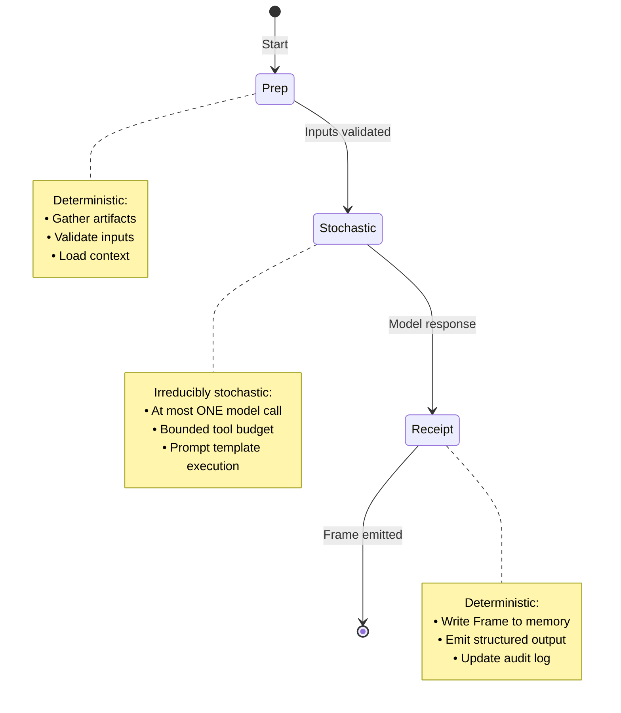

# Executor Decoupling Architecture

> **v0.3.0 Thesis:** Executors decouple system design from orchestration from model choice.

This document describes the separation of concerns between executors, orchestration, and model binding in LexRunner. It defines clear boundaries for what each layer owns and ensures IP clarity between proprietary (LexRunner) and open-source (Lex) components.

## Overview

LexRunner's architecture is organized into three distinct layers:

```
┌─────────────────────────────────────────────────────────────────────────────┐
│                              LexRunner                                       │
├─────────────────────────────────────────────────────────────────────────────┤
│                                                                             │
│  ┌─────────────────────────────────────────────────────────────────────┐   │
│  │                     Layer 3: Orchestration                           │   │
│  │  ─────────────────────────────────────────────────────────────────  │   │
│  │  • Merge pyramid construction                                        │   │
│  │  • Fan-out/fan-in coordination                                       │   │
│  │  • Gate sequencing and policy enforcement                            │   │
│  │  • Batch planning (Kahn's algorithm)                                 │   │
│  │  • Weave state machine                                               │   │
│  └─────────────────────────────────────────────────────────────────────┘   │
│                                    │                                        │
│                                    ▼                                        │
│  ┌─────────────────────────────────────────────────────────────────────┐   │
│  │                     Layer 2: Executors                               │   │
│  │  ─────────────────────────────────────────────────────────────────  │   │
│  │  • Narrow, versioned operational units                               │   │
│  │  • Tool budget (which tools, under what limits)                      │   │
│  │  • Guardrail bindings                                                │   │
│  │  • Jordan-mode protocol (prep → stochastic → receipt)                │   │
│  │  • Deterministic artifact gathering                                  │   │
│  └─────────────────────────────────────────────────────────────────────┘   │
│                                    │                                        │
│                                    ▼                                        │
│  ┌─────────────────────────────────────────────────────────────────────┐   │
│  │                     Layer 1: Model Binding                           │   │
│  │  ─────────────────────────────────────────────────────────────────  │   │
│  │  • LLM provider abstraction                                          │   │
│  │  • Prompt template resolution                                        │   │
│  │  • Token budget management                                           │   │
│  │  • Stochastic call execution                                         │   │
│  └─────────────────────────────────────────────────────────────────────┘   │
│                                                                             │
└─────────────────────────────────────────────────────────────────────────────┘
                                    │
                                    ▼
┌─────────────────────────────────────────────────────────────────────────────┐
│                              Lex (OSS Core)                                  │
├─────────────────────────────────────────────────────────────────────────────┤
│  • Frames and episodic memory                                               │
│  • Policy engine (lexmap.policy.json)                                       │
│  • Module ID resolution and aliasing                                        │
│  • Vocabulary and semantic foundations                                      │
└─────────────────────────────────────────────────────────────────────────────┘
```

## Layer Definitions

### Layer 1: Model Binding

**Purpose:** Abstract LLM provider details and manage stochastic model calls.

**Responsibilities:**

- Provider abstraction (OpenAI, Anthropic, local models)
- Prompt template loading and variable substitution
- Token counting and budget enforcement
- Retry and fallback strategies for model calls
- Response parsing and structured output extraction

**Does NOT own:**

- Which prompts to use (executor decision)
- When to call the model (Jordan-mode protocol decides)
- What to do with the response (executor/orchestration decision)

### Layer 2: Executors

**Purpose:** Encapsulate narrow, versioned operational units that follow the Jordan-mode protocol.

**Responsibilities:**

- **Prep phase:** Deterministically gather and validate inputs
- **Stochastic phase:** Execute at most one irreducibly stochastic model call
- **Receipt phase:** Emit at least one Frame as an auditable receipt
- Tool budget enforcement (which tools, how many calls, token limits)
- Guardrail binding (scope, epistemic, style, audit)
- Artifact collection and structured output

**Does NOT own:**

- Merge plans or merge order computation
- Gate orchestration or sequencing
- Fan-out/fan-in coordination
- Batch planning or dependency graphs
- Weave state machine transitions

**Example Executor: `senior-dev`**

```typescript
// From src/executors/seniorDev/types.ts
export const EXECUTOR_MODES: Record<ExecutorMode, ModeConfig> = {
  triage: {
    display_name: "PR Triage",
    prompt_file: "prompts/pr-analysis.prompt.md",
    purpose: "Quick PR assessment before deep review",
    prerequisites: ["prepare-review-context.sh"],
    output_type: "triage_report",
  },
  deep_review: {
    display_name: "Deep Code Review",
    prompt_file: "prompts/code-review.prompt.md",
    purpose: "Detailed code analysis with findings",
    prerequisites: ["prepare-review-context.sh", "recall-context.sh"],
    output_type: "review_report",
  },
  // ...
};
```

### Layer 3: Orchestration

**Purpose:** Coordinate multi-PR workflows, enforce policy, and manage the merge pyramid.

**Responsibilities:**

- Merge pyramid construction from `plan.json`
- Dependency graph computation (topological sort via Kahn's algorithm)
- Fan-out: Dispatch work across multiple PRs in parallel
- Fan-in: Collect results and determine merge eligibility
- Gate sequencing and execution coordination
- Policy enforcement (required gates, merge rules, overrides)
- Weave state machine (idle → planning → merging → validating → completed)
- Batch planning and layer-based execution
- Integration branch management

**Does NOT own:**

- Individual PR analysis (executor responsibility)
- Model selection or prompt design (model binding responsibility)
- Frame schema or memory storage (Lex responsibility)

## The Jordan-Mode Protocol

Executors follow a three-phase protocol that cleanly separates deterministic and stochastic work:



**Key Constraint:** An executor performs **at most one** irreducibly stochastic call (typically an LLM invocation). All other work must be deterministic and reproducible.

## IP Separation

### LexRunner-Only (Proprietary)

The following components are **LexRunner intellectual property** and not part of the Lex OSS core:

| Component           | Location                                | Description                                |
| ------------------- | --------------------------------------- | ------------------------------------------ |
| Merge Pyramid       | `src/core/plan.ts`, `src/mergeOrder.ts` | Dependency-ordered merge strategy          |
| Weave State Machine | `src/weave/`                            | Resumable merge execution                  |
| Gate Orchestration  | `src/gates.ts`                          | Quality gate sequencing and policy         |
| Batch Planner       | `src/orchestration/batchPlanner.ts`     | Kahn's algorithm for layer-based execution |
| Autopilot Levels    | `src/autopilot/`                        | Graduated automation (0-4)                 |
| Fan-out/Fan-in      | Orchestration layer                     | Multi-PR parallel coordination             |
| Executor Manifests  | `src/schemas/executorManifest.ts`       | Executor I/O contracts and guardrails      |
| CLI Orchestration   | `src/cli.ts`                            | Command orchestration and workflow         |

### Lex OSS Core (MIT License)

The following components are part of **Lex** and available under MIT license:

| Component          | Repository        | Description                              |
| ------------------ | ----------------- | ---------------------------------------- |
| Frames             | `Guffawaffle/lex` | Episodic memory units                    |
| Memory Store       | `Guffawaffle/lex` | Frame persistence and recall             |
| Policy Engine      | `Guffawaffle/lex` | `lexmap.policy.json` enforcement         |
| Module ID Aliasing | `Guffawaffle/lex` | Shorthand-to-canonical resolution        |
| Vocabulary         | `Guffawaffle/lex` | Canonical terms and semantic definitions |

### Boundary Diagram

```
┌────────────────────────────────────────────────────────────────────┐
│                     LexRunner (Proprietary)                         │
│  ┌──────────────────────────────────────────────────────────────┐  │
│  │                    Orchestration                              │  │
│  │  • merge-weave         • fan-out/fan-in                      │  │
│  │  • batch planning      • gate sequencing                     │  │
│  │  • autopilot levels    • policy enforcement                  │  │
│  └──────────────────────────────────────────────────────────────┘  │
│                              │                                      │
│  ┌──────────────────────────────────────────────────────────────┐  │
│  │                      Executors                                │  │
│  │  • senior-dev          • (future executors)                  │  │
│  │  • Jordan-mode protocol • tool budgets                       │  │
│  │  • guardrail bindings  • executor manifests                  │  │
│  └──────────────────────────────────────────────────────────────┘  │
│                              │                                      │
│  ┌──────────────────────────────────────────────────────────────┐  │
│  │                    Model Binding                              │  │
│  │  • provider abstraction  • token management                  │  │
│  │  • prompt resolution     • retry strategies                  │  │
│  └──────────────────────────────────────────────────────────────┘  │
└────────────────────────────────────────────────────────────────────┘
                               │
                               │ Uses (dependency)
                               ▼
┌────────────────────────────────────────────────────────────────────┐
│                        Lex (MIT License)                            │
│  ┌──────────────────────────────────────────────────────────────┐  │
│  │  • Frames              • Memory recall                       │  │
│  │  • Policy engine       • Module ID aliasing                  │  │
│  │  • Vocabulary          • Semantic foundations                │  │
│  └──────────────────────────────────────────────────────────────┘  │
└────────────────────────────────────────────────────────────────────┘
```

## What Executors Do NOT Handle

**Critical Clarification:** Executors are **not** responsible for:

1. **Merge Plans**
   - Executors do not compute or modify `plan.json`
   - They do not determine merge order or dependencies
   - They do not manage the merge pyramid

2. **Gate Orchestration**
   - Executors do not sequence gate execution
   - They do not determine which gates to run
   - They do not enforce gate policies

3. **Fan-out Coordination**
   - Executors do not dispatch work across multiple PRs
   - They do not manage parallel execution
   - They do not collect and aggregate results

4. **Weave State Machine**
   - Executors do not transition weave states
   - They do not manage lock files
   - They do not handle resume/pause operations

5. **Batch Planning**
   - Executors do not compute Kahn layers
   - They do not determine which items belong in which batch
   - They do not manage batch execution order

## What Executors Own

Executors are responsible for:

1. **Narrow Operational Scope**
   - A single, well-defined task (e.g., "PR code review")
   - Versioned I/O contracts via executor manifests
   - Deterministic prep and receipt phases

2. **Jordan-Mode Protocol Compliance**
   - Deterministic input validation
   - At most one stochastic model call
   - Frame emission as receipt

3. **Tool Budget Enforcement**
   - Which tools the executor may call
   - Maximum tool call limits
   - Token output limits

4. **Guardrail Bindings**
   - Scope guardrails (allowed/denied paths)
   - Epistemic guardrails (uncertainty handling)
   - Style guardrails (output formatting)
   - Audit guardrails (logging level, frame schema)

5. **Artifact Collection**
   - Gathering inputs during prep phase
   - Producing structured outputs
   - Emitting Frames to Lex memory

## Executor Manifest Schema

Executors are defined by manifests that codify their contracts:

```yaml
schemaVersion: executor-1.0.0
role: senior-dev
description: Code review executor with Lex memory integration

toolBudget:
  allowed:
    - gh pr view
    - git diff
    - npm run lint
    - npm run typecheck
    - npm test
    - lex recall
    - lex remember
  denied:
    - git push
    - git merge
    - rm -rf
  limits:
    maxToolCalls: 50
    maxTokensOut: 8000

guardrails:
  scope:
    allowedPaths:
      - src/**
      - tests/**
      - docs/**
    deniedPaths:
      - node_modules/**
      - .git/**
  epistemic:
    allowIDK: true
    escalationThreshold: medium-risk
  style:
    requirePlan: false
    requireSummary: true
  audit:
    level: normal
    frameSchema: senior-dev-review

jordanModeProtocol:
  prepPhase:
    - prepare-review-context
    - recall-context
  stochasticPhase:
    promptTemplate: prompts/code-review.prompt.md
    maxCalls: 1
  receiptPhase:
    frameType: review
    fields:
      - reference_point
      - summary_caption
      - module_scope
      - next_action
```

## Design Rationale

### Why This Separation?

1. **Testability:** Each layer can be tested independently. Orchestration logic doesn't require model calls; executors don't require full merge pyramid setup.

2. **Substitutability:** Model binding layer allows swapping providers without changing executors or orchestration. Executors can be added/removed without affecting the merge pipeline.

3. **IP Protection:** Clear boundary between proprietary orchestration (LexRunner) and open-source foundations (Lex).

4. **Auditability:** Each layer produces traceable artifacts. Frames capture executor decisions; orchestration logs capture merge state transitions.

5. **Scalability:** Orchestration can coordinate many executors in parallel without coupling their implementations.

### Alignment with v0.3.0 Thesis

> "Executors decouple system design from orchestration from model choice."

- **System Design:** Executors encapsulate operational patterns (e.g., code review workflow) without knowing about merge pyramids.
- **Orchestration:** The merge-weave layer coordinates work without knowing executor implementation details.
- **Model Choice:** The model binding layer abstracts providers, allowing executor prompts to run on any supported LLM.

## Related Documentation

- [Architecture Overview](./architecture.md) — System-wide design philosophy
- [Gates](./gates.md) — Gate execution and validation
- [Autopilot Levels](./autopilot-levels.md) — Graduated automation
- [Merge Weave State Machine](./merge-weave-state-machine.md) — Resumable execution
- [Orchestration Commands](./orchestration.md) — Batch planning and Kahn's algorithm
- [AGENTS.md](../AGENTS.md) — Operating principles and contracts
- [TERMS.md](./TERMS.md) — Canonical terminology
- [ADR-000](./adr/ADR-000-product-naming-and-branding.md) — LexRunner vs Lex branding

## Appendix: Executor Contract Summary

| Executor Responsibility            | Orchestration Responsibility       |
| ---------------------------------- | ---------------------------------- |
| Validate inputs per schema         | Provide inputs from plan           |
| Gather artifacts deterministically | Coordinate which PRs to process    |
| Execute ≤1 stochastic call         | Sequence gate execution            |
| Emit Frame receipt                 | Collect results for merge decision |
| Respect tool budget                | Enforce policy across batches      |
| Bind to guardrail profile          | Manage weave state machine         |
