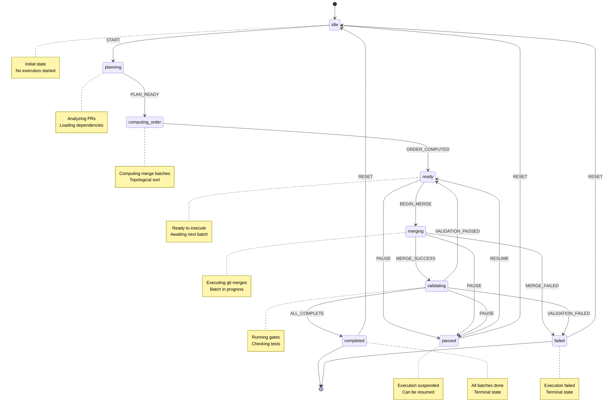

# Merge-Weave Execution State Machine

## Overview

The merge-weave execution state machine provides a robust, resumable execution framework for merging multiple PRs in a controlled, step-by-step manner. It includes dry-run capabilities, state persistence, and resume functionality.

## State Diagram



## States

### `idle`

Initial state before any execution has started. The system is ready to accept a new execution request.

**Available Transitions:**

- `START` → `planning`

### `planning`

Loading and analyzing the plan, validating PRs, and preparing for execution.

**Available Transitions:**

- `PLAN_READY` → `computing_order`

### `computing_order`

Computing the topological order of merges and organizing them into batches based on dependencies.

**Available Transitions:**

- `ORDER_COMPUTED` → `ready`

### `ready`

Ready to execute the next batch of merges. This is a checkpoint state where execution can be paused or continued.

**Available Transitions:**

- `BEGIN_MERGE` → `merging`
- `PAUSE` → `paused`

### `merging`

Actively executing git merge operations for the current batch.

**Available Transitions:**

- `MERGE_SUCCESS` → `validating`
- `MERGE_FAILED` → `failed`
- `PAUSE` → `paused`

### `validating`

Running gates (tests, lints, builds) on the merged result to ensure quality.

**Available Transitions:**

- `VALIDATION_PASSED` → `ready` (if more batches remain)
- `ALL_COMPLETE` → `completed` (if all batches done)
- `VALIDATION_FAILED` → `failed`
- `PAUSE` → `paused`

### `paused`

Execution is suspended. The state is persisted and can be resumed later.

**Available Transitions:**

- `RESUME` → `ready`
- `RESET` → `idle`

### `completed`

Terminal state indicating all batches were successfully merged and validated.

**Available Transitions:**

- `RESET` → `idle`

### `failed`

Terminal state indicating execution failed due to merge conflicts or validation failures.

**Available Transitions:**

- `RESET` → `idle`

## Events

| Event               | Description                     |
| ------------------- | ------------------------------- |
| `START`             | Begin execution from idle state |
| `PLAN_READY`        | Plan loaded and validated       |
| `ORDER_COMPUTED`    | Merge order calculated          |
| `BEGIN_MERGE`       | Start merging current batch     |
| `MERGE_SUCCESS`     | Batch merged successfully       |
| `MERGE_FAILED`      | Merge encountered conflicts     |
| `VALIDATION_PASSED` | Gates passed for current batch  |
| `ALL_COMPLETE`      | All batches completed           |
| `VALIDATION_FAILED` | Gates failed for current batch  |
| `PAUSE`             | Suspend execution               |
| `RESUME`            | Resume from paused state        |
| `RESET`             | Return to initial state         |

## Lock File (weave-lock.json)

The lock file persists execution state and enables resume capability.

### Structure

```typescript
interface WeaveLockFile {
  schemaVersion: string; // Lock file format version
  runId: string; // Unique execution ID (ULID)
  planHash: string; // SHA-256 hash of plan + PR heads
  state: WeaveState; // Current execution state
  context: WeaveContext; // Full execution context
  createdAt: string; // ISO timestamp
  updatedAt: string; // ISO timestamp
}
```

### Hash Validation

The `planHash` is computed as:

```
SHA-256(canonical_json(plan) + ":" + canonical_json(prHeads))
```

This ensures that resuming is only allowed if:

1. The plan.json hasn't changed
2. No PR heads have been updated (no new commits)

If either changes, the lock file is invalidated and a fresh execution is required.

## Usage

### Dry Run

Preview the execution plan without making any changes:

```bash
lex-pr merge --plan plan.json --dry-run
```

**Output:**

```json
{
  "summary": {
    "totalBatches": 3,
    "totalItems": 5,
    "targetBranch": "main"
  },
  "batches": [
    {
      "batchNumber": 0,
      "items": ["pr-123", "pr-124"],
      "dependencies": [],
      "parallelizable": true
    },
    {
      "batchNumber": 1,
      "items": ["pr-125"],
      "dependencies": ["pr-123", "pr-124"],
      "parallelizable": false
    },
    {
      "batchNumber": 2,
      "items": ["pr-126", "pr-127"],
      "dependencies": ["pr-125"],
      "parallelizable": true
    }
  ],
  "prs": [
    {
      "name": "pr-123",
      "currentSha": "abc123...",
      "status": "ready"
    }
    // ... more PRs
  ],
  "checks": {
    "cleanWorkingDirectory": true,
    "branchExists": true,
    "conflictsPredicted": 0
  }
}
```

### Execute

Start a new execution:

```bash
lex-pr merge --plan plan.json --execute
```

This will:

1. Create `weave-lock.json` with execution state
2. Execute merges batch by batch
3. Update lock file after each batch
4. Delete lock file on completion

### Resume

Resume from a paused or interrupted execution:

```bash
lex-pr merge --plan plan.json --resume <runId>
```

The system will:

1. Read `weave-lock.json`
2. Validate the plan hash
3. Resume from the last successful state
4. Continue execution

**Note:** Resume requires the lock file's `planHash` to match the current plan + PR heads. If they've changed, you must start a fresh execution.

## Implementation Details

### State Persistence

The lock file is updated after each state transition to ensure the execution can be resumed at any point. Critical updates occur:

- After computing merge order
- After each batch merge
- After each validation
- When entering paused state

### Error Handling

- **Merge conflicts:** Transition to `failed` state, preserve partial progress
- **Validation failures:** Transition to `failed` state, rollback may be required
- **Invalid resume:** Reject with clear error message about hash mismatch

### Idempotency

Each state transition is idempotent. If a state update fails partway through, re-entering the same state should produce the same result.

## Examples

### Example 1: Simple Linear Execution

```
Plan: pr-1 → pr-2 → pr-3

States: idle → planning → computing_order → ready
         → merging (pr-1) → validating → ready
         → merging (pr-2) → validating → ready
         → merging (pr-3) → validating → completed
```

### Example 2: Parallel Batches

```
Plan: pr-1, pr-2 (parallel) → pr-3 (depends on both)

Batches:
  - Batch 0: [pr-1, pr-2]
  - Batch 1: [pr-3]

States: idle → planning → computing_order → ready
         → merging (batch 0) → validating → ready
         → merging (batch 1) → validating → completed
```

### Example 3: Resume After Pause

```
Initial run:
  idle → ... → ready → merging → paused

Resume run:
  (Read lock file)
  paused → ready → merging → validating → completed
```

### Example 4: Failure Recovery

```
Run with conflict:
  idle → ... → ready → merging → failed

After manual resolution:
  failed → reset → idle → ... (fresh execution)
```

## Testing

The state machine includes comprehensive tests for:

- All valid state transitions
- Invalid transition rejection
- Guard conditions
- Context updates
- Lock file creation/validation
- Hash computation
- Resume capability

See `tests/weave/stateMachine.spec.ts` and `tests/weave/lockFile.spec.ts`.

## Future Enhancements

- **Automatic conflict resolution:** Apply mechanical weave rules automatically
- **Partial rollback:** Rollback only failed batch, not entire execution
- **Checkpoint branches:** Create git branches at each batch for easier recovery
- **Parallel execution:** Execute parallelizable batches concurrently
- **Progress estimation:** Provide time estimates based on historical data
